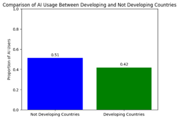

# Code and Consciousness: An Analysis of the Adoption and Perception of AI Across Developer Demographics and Specializations

Mackenly Jones, MBA Student - Lincoln Memorial University School of Business

April 29, 2024

## Abstract
This study analyzes Stack Overflow's 2023 developer survey data to uncover insights into the developer community's adoption and perception of AI technologies across various demographics and specializations. Using inferential and descriptive statistics, the analysis explores relationships between AI usage/sentiment and factors such as age, education level, programming languages, code editors, work environment, and geographic location. Key findings include: younger developers view AI more favorably; Python users and remote workers are more likely to use AI; Visual Studio Code users adopt AI more than Vim users; higher education does not significantly impact AI trust; developers in less developed countries use AI less; and perceived AI benefits correlate with adoption. A multiple regression model to predict compensation based on AI perceptions and demographics did not yield significant results. The insights suggest opportunities for targeted marketing, product design considerations, global expansion strategies, and AI education. The study highlights the need for continuous monitoring of these dynamic relationships and discusses the potential for selection bias in the survey data. Future research directions are proposed. Understanding these nuances in AI adoption can help companies make data-driven decisions to optimize their AI initiatives within the developer community.

## Table of Contents
- [Introduction](#introduction)
- [Purpose](#purpose)
- [Goals](#goals)
- [Executive Summary](#executive-summary)
- [Methodologies](#methodologies)
  - [Analysis Tools](#analysis-tools)
  - [Data Source and Preparation](#data-source-and-preparation)
  - [Procedure](#procedure)
    - [AI Opinions and Age](#ai-opinions-and-age)
    - [AI Use and Higher Education](#ai-use-and-higher-education)
    - [AI Use and Python](#ai-use-and-python)
    - [AI Use and Code Editors](#ai-use-and-code-editors)
    - [AI Use and Remote Work](#ai-use-and-remote-work)
    - [Correlation Between AI Adoption and Perceived Benefits](#correlation-between-ai-adoption-and-perceived-benefits)
    - [AI Adoption in Developing Countries](#ai-adoption-in-developing-countries)
    - [Modeling Developer Salaries Using AI Perceptions](#modeling-developer-salaries-using-ai-perceptions)
  - [Key Findings](#key-findings)
- [Interpretation](#interpretation)
    - [Data Story](#data-story)
    - [Potential Applications](#potential-applications)
    - [Opportunities for Further Analysis](#opportunities-for-further-analysis)
- [References](#references)
- [Appendix A](#appendix-a)

## Introduction
This analysis aims to explore how various developer demographics have adopted and perceived artificial intelligence technologies. This subject was selected because, as a developer, I am interested in exploring potential inequities in AI adoption, specializations not effectively utilizing AI, and how different tooling affects the adoption of AI. 

## Purpose
Using Stack Overflows’ 2023 survey data provides detailed results that may uncover insights to help inform technology rollout decisions. The summary statistics overview of the data published by Stack Overflow does include some high-level charts showing the percentage of answers; however, it does not explore the data on a deeper level (Stack Overflow Labs, 2023a). The same can be said about Stack Overflow’s sentiment analysis of AI/ML, which goes deeper than the overview but still only looks at that data at a high level (Stack Overflow Labs, 2023b). Through this project, I aim to look at the data based on variables such as demographic data and developer specialization to gain a more nuanced understanding of AI-related results.

## Goals
The research questions I am looking to explore are:
- Which demographics are statistically more likely to adopt AI tools?
- Are remote workers more likely to utilize AI than their peers?
- Is there a statistically significant difference in AI adoption within developing countries?
- Can compensation be predicted based on demographic data and AI attitudes? 

## Executive Summary
### Overview
This analysis uses the 2023 Stack Overflow Developer Survey data to uncover insights into the developer community's perception and adoption of AI technologies. Using inferential, predictive, and descriptive statistics, the study examines the data from various perspectives to explore how different developer demographics have adopted artificial intelligence technologies in their workflows.

### Findings
- AI Opinions and Age: Younger developers have a more statistically significant favorable opinion of AI compared to older developers.
- AI Use and Higher Education: There is no significant difference in trust towards AI between developers with different education levels.
- AI Use and Python: AI users are statistically more likely to be Python developers than not.
- AI Use and Code Editors: Developers who use Visual Studio Code are statistically more likely to use AI than users of Vim.
- AI Use and Remote Work: Remote workers are statistically more likely to use AI than in-person workers.
- Correlation Between AI Adoption and Perceived Benefits: A moderate statistically significant positive correlation exists between the level of AI adoption and perceived AI benefits.
•	AI Adoption in Developing Countries: There is a significant difference in the level of AI adoption between developers in developing countries and those in developed countries.
•	Modeling Developer Salaries Using AI Perceptions: Attempting to model developer compensation using AI perceptions and demographic data did not yield statistically significant results.

In summary, the analysis revealed interesting insights into the relationship between developer demographics; however, modeling developer salaries based on AI perceptions was unsuccessful.

### Application
Potential practical applications of these insights include the following use cases:
- Targeted marketing and user acquisition: AI companies should consider targeting marketing campaigns toward younger audiences who may be more likely to respond.
- Product design and user experience: If remote workers are more likely to use AI, companies that offer remote work products and services should consider ways to improve user experience by integrating AI into products. AI companies should consider ways to improve user experience for remote workers. This could include features such as real-time cloud-based collaboration, integration with popular remote communication platforms like Slack, and easy access from mobile devices. 
- Education and training: The lack of a significant difference in AI trust based on education levels suggests an opportunity, especially in higher education institutions, to educate everyone on the risks and limitations of AI technologies.
- Global expansion strategy: Since there is a significant difference between AI adoption across developed and developing countries, industry leaders, nonprofits, and other organizations should consider ways to ensure more equitable access to AI technology. This could involve partnering with local organizations, tailoring products to specific regional needs, ensuring products are localized, setting prices at a level practical for developing markets, and investing in infrastructure to support AI adoption in developing countries.
- Continuous monitoring and improvement: The data reveals a moderate correlation between AI adoption and perceived benefits, which is expected. Using this information, companies should consider focusing marketing efforts on increasing AI perceptions among developers who are not currently using AI tools.
- Realistic expectations and product positioning: The inability to accurately model developer salaries based on AI perceptions suggests that companies should be cautious about making bold claims regarding the financial benefits of adopting their AI products. Instead, they should focus on highlighting the practical benefits and use cases of their AI tools, such as increased productivity, improved code quality, and faster time-to-market. This also poses an interesting question: If productivity does rise, does that mean compensation will rise, fall, or stay the same over the long term?

By leveraging these insights, companies can make data-driven decisions to optimize the rollout of their AI products, target the right audiences, and ensure the long-term success of their AI initiatives in the developer community.

## Methodologies
The following sections provide an overview of the tools, data source, and preparation and cleaning steps. Finally, an overview of analysis procedures is provided.

### Analysis Tools
A Jupyter Notebook using Python was used to analyze the data. This enables auditability and reproducibility of the analysis and results. The notebook and accompanying source code are available under the MIT License within the following repository: https://github.com/mackenly/ai-perception-and-adoption-in-the-developer-community 

### Data Source and Preparation
The data set, “The Public 2023 Stack Overflow Developer Survey Results,” was collected by Stack Overflow, a popular programming and tech forum, from May 8-19, 2023. Since the survey relied on respondents visiting a Stack Overflow site or seeing promotional content and choosing to respond, it was sampled using convenience sampling. Within the survey results, there are 89,184 entries, giving a good sample size with 82 questions ranging in value type. Stack Overflow published the data under the Open Data Commons Open Database License v1.0, an open-source data license permitting use with attribution (The Open Knowledge Foundation, n.d.). Whether a country is classified as developing or not is based on the United Nations’ Country Classifications (United Nations, 2014).

The data preparation processes involved multiple levels of cleaning to ensure the reliability and validity of the data. One such issue was a character encoding problem where “Master’s degree” needed to be converted to “Master’s degree.” In addition, the survey included many different questions that were not relevant to the goals of this analysis. Those variables were discarded. Finally, categorial data such as Likert scale questions were converted into numerical data using on-hot encoding. The entire preparation and cleaning process can be found within the notebook’s code, which is available for review to ensure transparency and reproducibility of the analysis.

### Procedure
The following statistics used =0.05 unless otherwise specified, which gives a z-test critical value of absolute 1.96.

#### AI Opinions and Age.
*H0: There is no significant difference in opinion towards AI between younger and older developers.*

*H1: Younger developers have a more favorable opinion of AI.*

- T-Statistic: 7.747
- P-Value: 1.01x10-14 

The results are statistically significant at the 0.05 level. As a result, we can reject the null hypothesis.
 


Figure 1 - Distribution of AI Sentiment by Age Group


#### AI Use and Higher Education.
*H0: There is no significant difference in trust towards AI between developers with different education levels.*

*H1: Developers without higher education are more likely to trust AI.*

- T-Statistic: -0.015
- P-Value: 0.988

The results are not statistically significant at the 0.05 level. As a result, we can not reject the null hypothesis.


Figure 2 - Distribution of AI Sentiment by Education Level

#### AI Use and Python.
*H0: There is no significant difference in AI usage between developers who do and do not use Python.*

*H1: AI users are most likely to be Python developers.*

- Z-Statistic: 18.980
- P-Value: 2.49x10-80

The z-score is greater than the critical value of 1.96. As a result, we can reject the null hypothesis based on the z-test.

The results are statistically significant at the 0.05 level. As a result, we can reject the null hypothesis based on the p-value.


 
Figure 3 - Comparison of AI Usage Between Python and Non-Python Developers

#### AI Use and Code Editors.
*H0: There is no significant difference in AI usage between developers who use Visual Studio Code and Vim.*

*H1: Developers who use Visual Studio Code are more likely to use AI than users of Vim.*

- Z-Statistic: -13.038
- P-Value: 7.411x10-39

The z-score is greater than the critical value of 1.96. As a result, we can reject the null hypothesis based on the z-test.

The results are statistically significant at the 0.05 level. As a result, we can reject the null hypothesis based on the p-value.


 
Figure 4 - Comparison of AI Usage Between Vim and VS Code Developers

#### AI Use and Remote Work.
*H0: There is no significant difference in AI usage between remote workers and in-person workers.*

*H1: Remote workers are more likely to use AI.*

- Z-Statistic: -5.905
- P-Value: 3.529x10-09

The z-score is greater than the critical value of 1.96. As a result, we can reject the null hypothesis based on the z-test. 

The results are statistically significant at the 0.05 level. As a result, we can reject the null hypothesis based on the p-value.


 
Figure 5 - Comparison of AI Usage Between In-Person and Not In-Person Workers

#### Correlation Between AI Adoption and Perceived Benefits.
*H0: There is no significant correlation between the level of AI adoption and perceived AI benefits.*

*H1: The level of AI adoption correlates positively with perceived AI benefits.*

- Correlation between AI trust and AI usage: 0.135
- P-Value: 5.641x10-247
- The correlation is moderate.

The correlation is statistically significant at the 0.05 level. As a result, we can reject the null hypothesis based on the p-value.


 
Figure 6 - Perceived Benefits of AI by Adoption Status


#### AI Adoption in Developing Countries.
*H0: There is no significant difference in the level of AI adoption between developers in developing countries and those in developed countries.*

*H1: There is a significant difference in the level of AI adoption between developers in developing countries and those in developed countries.*

- Chi-Square Statistic: 633.746
- P-Value: 7.656x10-140
- Critical Value: 3.841

The results are statistically significant at the 0.05 level. As a result, we can reject the null hypothesis based on the p-value.


 
Figure 7 - Comparison of AI Usage Between Developing and Not Developing Countries

#### Modeling Developer Salaries Using AI Perceptions.
*H0: There is no significant relationship between developer compensation and demographics and attitudes towards AI.*

*H1: Developer compensation can be predicted based on demographics and attitudes towards AI.*

Identified correlation between predictors:
- YearsCode: 0.35
- IsMacUser: 0.18
- IsInPerson: 0.16
- IsWindowsUser: 0.12
- AIBen: 0.12
- AISent: 0.03
- IsVimUser: 0.09
- HasHighSchool: 0.06

The model formula is in Appendix A. This data was cleaned up further, removing compensation outliers. This helps account for non-full-time entries and those with abnormally large compensation packages. 

- Mean Squared Error: 2286617295.39998
- Root Mean Squared Error: 47818.587
- R-Squared Value: 0.20575

The model is not a good fit for the data. As a result, we cannot reject the null hypothesis.

The model is not statistically significant at the 0.05 level. As a result, we cannot reject the null hypothesis based on the p-value.


 
Figure 8 - Boxplot of Yearly Compensation with Outliers Removed


Figure 9 - Predicted vs Actual Yearly Compensation

### Key Findings
- Younger developers have a more favorable view of AI.
- Higher education does not seem to have a statistically significant impact on AI trust.
- Python users are likely to be AI users, which aligns with Python being a language commonly used for AI.
- Visual Studio Code users are more likely to use AI than Vim users. 
- Remote workers are more likely to use AI.
- Those who perceive AI positively are likely also to use AI.
- Developers in less developed countries are less likely to use AI.
- Using AI perceptions and demographics is insufficient to accurately predict compensation using multiple regression.

## Interpretation
The following sections attempt to discuss the impact of this analysis’ findings and propose potential applications of the insights uncovered.

### Data Story
The data tells a story about how the developer community is becoming increasingly aware of and interested in AI technologies. Still, within the developer community, multiple subsegments have different perceptions and adoption rates, specifically among various programming languages, work environments, geographic locations, and ages. The data shows that young developers and Python developers are leading the charge in adopting AI, and remote workers, perhaps motivated by enhancing productivity, are also likely to use AI tools. Alarmingly, the data says that high education has not resulted in a greater understanding or skepticism of AI technologies. Finally, the data calls out potential challenges faced by developers in developing nations that have lower AI adoption rates.

### Potential Applications
This research is potentially valuable for marketing firms looking to sell AI products and developer non-profits looking to empower developers in developing countries. Additionally, understanding which developers have adopted AI could allow developer tools and software companies to better market their products (e.g., code editors, operating systems, and AI tools). Finally, this information may be valuable to educators in higher education, considering whether teaching the limitations and potential problems with AI is worthwhile. 

### Opportunities for Further Analysis
Future research should be conducted to assess the relationship between AI usage, demographics, perception, and other variables. It is plausible that these relationships may change over time as AI becomes more broadly adopted. This research could also be affected by selection bias since there may be unexplored relationships between developers who use Stack Overflow and are willing to participate in a voluntary study and the values of the variables. 

## References
- Stack Overflow Labs. (2023a). *Stack Overflow Developer Survey 2023*. Stack Overflow. https://survey.stackoverflow.co/2023/#overview 
- Stack Overflow Labs. (2023b, June 12). *Developer sentiment around AI/ML*. Stackoverflow.co; Stack Overflow. https://stackoverflow.co/labs/developer-sentiment-ai-ml/ 
- The Open Knowledge Foundation. (n.d.). *Open Data Commons Open Database License (ODbL) v1.0*. Opendatacommons.org; The Open Knowledge Foundation. Retrieved March 23, 2024, from https://opendatacommons.org/licenses/odbl/1-0/ 
- United Nations. (2014). *Country Classification Data sources, Country Classifications and Aggregation Methodology Data Sources* (pp. 143–150). United Nations. https://www.un.org/en/development/desa/policy/wesp/wesp_current/2014wesp_country_classification.pdf 

## Appendix A
Regression model:

```y = -0.00 + 4013.36 * YearsCode + 12578.05 * IsMacUser + -6727.45 * IsInPerson + -3384.48 * IsWindowsUser + -11440.32 * AIBen + -4308.82 * AISent + 8180.27 * IsVimUser + -2477.29 * HasHighSchool + -58.86 * YearsCode^2 + 22.85 * YearsCode IsMacUser + -188.70 * YearsCode IsInPerson + 141.87 * YearsCode IsWindowsUser + 136.41 * YearsCode AIBen + -7.86 * YearsCode AISent + -166.29 * YearsCode IsVimUser + -453.33 * YearsCode HasHighSchool + 12578.05 * IsMacUser^2 + -6541.50 * IsMacUser IsInPerson + -13541.83 * IsMacUser IsWindowsUser + 320.89 * IsMacUser AIBen + -613.11 * IsMacUser AISent + 584.97 * IsMacUser IsVimUser + -94.94 * IsMacUser HasHighSchool + -6727.45 * IsInPerson^2 + 870.13 * IsInPerson IsWindowsUser + 1275.29 * IsInPerson AIBen + 893.82 * IsInPerson AISent + -1589.83 * IsInPerson IsVimUser + -1804.07 * IsInPerson HasHighSchool + -3384.48 * IsWindowsUser^2 + -1980.00 * IsWindowsUser AIBen + 2427.00 * IsWindowsUser AISent + -524.96 * IsWindowsUser IsVimUser + 3543.34 * IsWindowsUser HasHighSchool + 171.62 * AIBen^2 + 814.39 * AIBen AISent + 955.65 * AIBen IsVimUser + 2740.78 * AIBen HasHighSchool + 362.18 * AISent^2 + -1917.05 * AISent IsVimUser + -2115.96 * AISent HasHighSchool + 8180.27 * IsVimUser^2 + -7298.70 * IsVimUser HasHighSchool + -2477.29 * HasHighSchool^2 + 63175.07```
